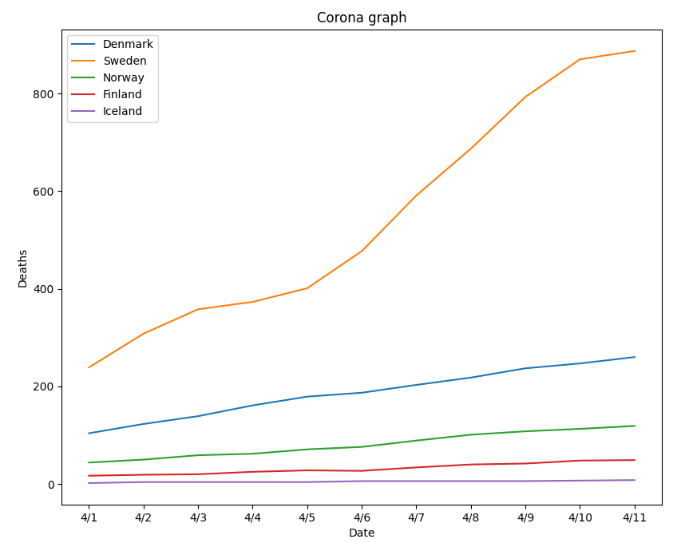

# Corona graph 

### Description
This was just a fun little project to try out matplotlib with some corona data from an API.

### Preview



### Install

```bash
git clone "https://github.com/ViggoGaming/corona-graph.git"
cd corona-graph
pip install -r requirements.txt
```

### Usage

```bash
python app.py
```

To change the countries that are shown in the plot edit **line 6**.
```python
#countries = ["Denmark", "Sweden", "Norway", "Finland", "Iceland"]
countries = ["US", "Italy", "Spain"]
```

To save the plot as a png uncomment this at **line 21**.
```python
#plt.savefig('graph.png')
plt.savefig('graph.png')
```