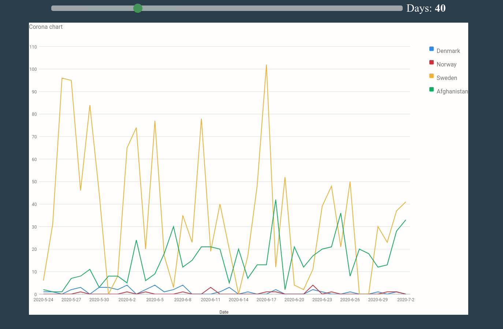

# Corona graph 

### Description
This project was first built using `matplotlib`, but I then changed it over to `google-charts`.

### Preview



### Install

```bash
$ git clone "https://github.com/ViggoGaming/corona-graph.git"
$ cd corona-graph
$ pip install -r requirements.txt
```

### Usage

```bash
$ python app.py
```

To see the application go to this url in your browser:
```
http://localhost:5000
```

To change the countries that are shown in the plot edit **line 9** in `app.py`.
```python
#countries = ["Denmark", "Sweden", "Norway", "Finland", "Iceland"]
countries = ["US", "Italy", "Spain"]
```

# Contributing
You are welcome to contribute to the project if you want to.